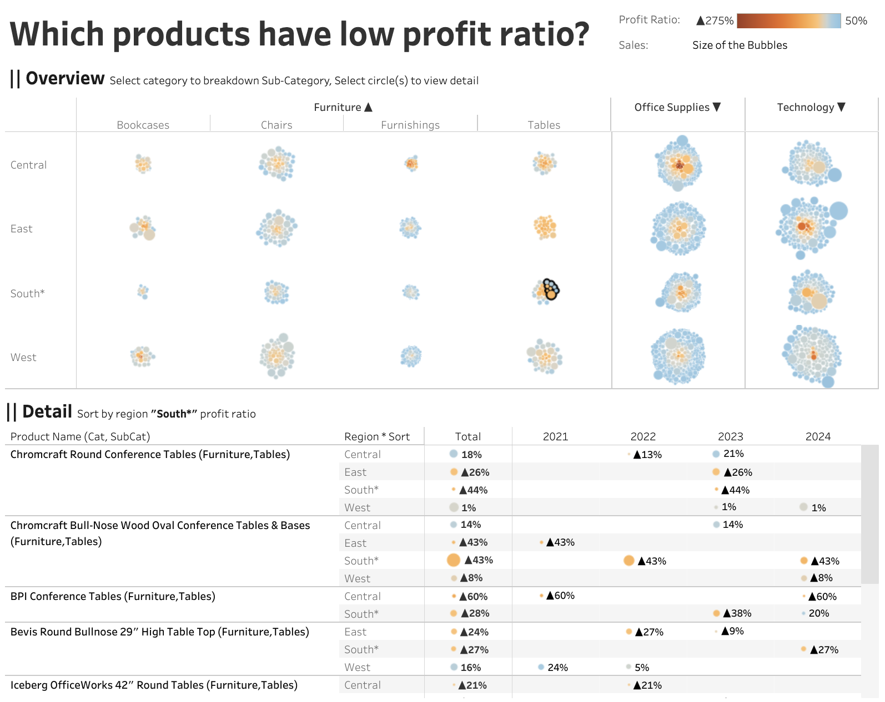

# Workout Wednesday 2025 | Week 14 | Low Profit Ratio Products

**Author**: Yusuke Nakanishi  
**Challenge Contributor**: YamaG (@m_yamag)

---

## Overview
This week's challenge involves creating a dashboard in Tableau to visualize products with low profit ratios using packed bubble charts. The challenge is hosted as part of Tableau Community Month and presented by YamaG, a notable contributor to the Tohoku User Group and the #1日1Tableau initiative.

---

## Requirements

### Dashboard Specifications:
- **Size**: 1400 x 800 px
- **Chart Type**: Bubble chart displaying each product name, segmented by region and category
- **Bubble Attributes**:
  - Size: Sales
  - Color: Profit Ratio
  - Clustering: Products with lower profit ratios should cluster toward the center
- **Interactions**:
  - Clicking on a category header drills down to display subcategories
  - Clicking the same category again drills back up
- **Details Panel**:
  - Displays product-level details sorted by Profit Ratio (ascending order) for the selected region
- **Tooltips and Formatting**:
  - Match the provided specifications

### Dataset:
- **Source**: Sample Superstore data (2024 version)

---

## Steps to Complete

1. **Set Up Workspace**:
   - Create a new Tableau workbook with the specified dashboard size (1400 x 800 px).

2. **Data Preparation**:
   - Load the Sample Superstore (2024 version) dataset.

3. **Bubble Chart Creation**:
   - Use `Product Name` for individual bubbles.
   - Segment by `Region` and `Category`.
   - Set bubble size to `Sales`.
   - Set bubble color to `Profit Ratio`, using a gradient scale.
   - Ensure low-profit-ratio products cluster toward the center using Tableau clustering features.

4. **Interactivity**:
   - Create a drill-down feature using Category headers to toggle between Subcategory and Category views.

5. **Details Panel**:
   - Add a table displaying product-level details.
   - Sort products by `Profit Ratio` in ascending order.
   - Filter details by the selected `Region`.

6. **Tooltips and Formatting**:
   - Customize tooltips to include `Product Name`, `Sales`, and `Profit Ratio`.
   - Ensure consistent formatting across the dashboard.

7. **Testing**:
   - Validate all interactions and ensure alignment with the requirements.

8. **Publish**:
   - Publish the dashboard to Tableau Public.

---

## Snapshot

---

## Tableau Public Link

[View the Dashboard on Tableau Public](https://public.tableau.com/shared/2G68KRJWJ?:display_count=n&:origin=viz_share_link)

---

## Author Notes
This challenge was both fun and insightful, offering a unique opportunity to explore clustering techniques in Tableau. Thanks to YamaG for this engaging problem statement!
